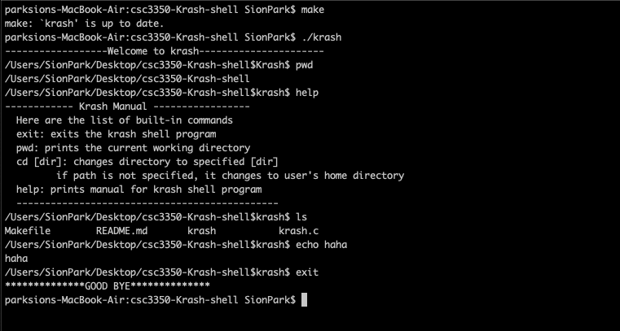

## Running krash

Krash is a shell program that has its own built in functions. 
In order to build the krash program, run the below command.
```
make
```
You can start the shell program by writing the below command.
```
./krash
```
You can also remove the krash executable by typing,
```
make clean
```

## Built in functions

  * exit – exits the program
  ```
  Usage: exit
  ```

  * pwd –  prints the current working directory.  
  ```
  Usage: pwd
  ```
  * cd [dir] – changes directory. If the optional dir is provided, the program changes to the specified directory. 
    If no arguments are provided, it changes to the user’s home directory. 
  ```
  Usage: cd[dir]
  ```
  * help – lists all built-in commands with short descriptions. 
  ```
  Usage: help
  ```

## Non-built in functions

Any non-built-in command should be executed if it is in one of the directories specified in the user’s path. 

* Fork a child process, pass appropriate arguments to exec, and wait for the child to return before continuing to accept user input.
